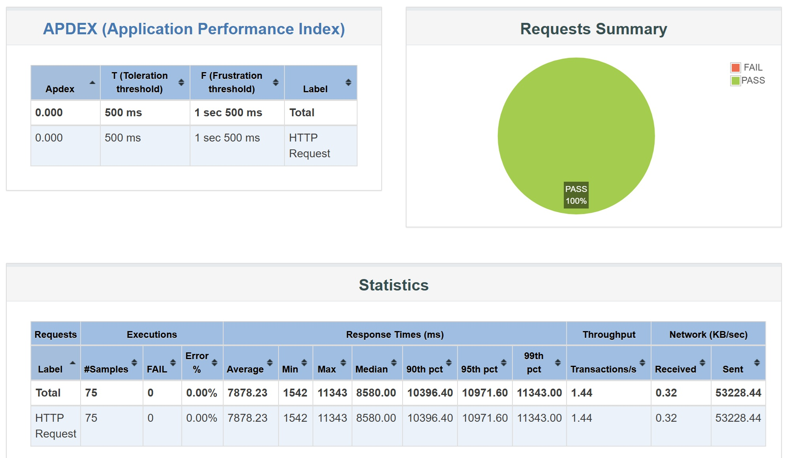
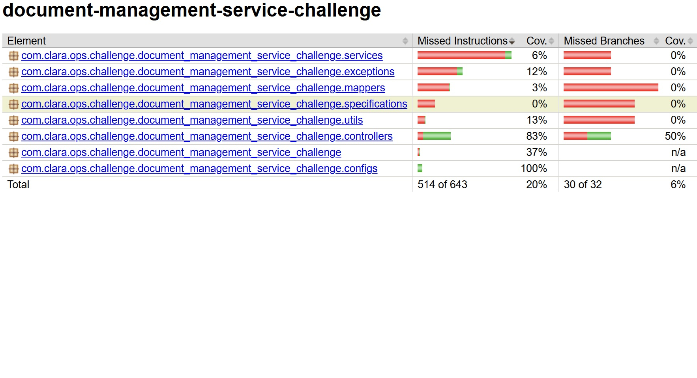

# Document management service

## Description

This project is a backend application built with Java 17 and Spring Boot. It includes unit tests using Mockito and performance tests using JMeter. The application is containerized using Docker and relies on PostgreSQL as the database and MinIO for storage.

## Prerequisites

Before running the application, ensure you have the following installed:

- **Java 17**
- **Maven**
- **Docker & Docker Compose**

## Environment Variables

The following environment variables must be created and configured before running the application:

### PostgreSQL:

```sh
export POSTGRESQL_USERNAME=<your_postgresql_username>
export POSTGRESQL_PASSWORD=<your_postgresql_password>
export POSTGRESQL_DATABASE=challenge
export POSTGRESQL_POSTGRES_PASSWORD=<your_postgresql_postgres_password>
```

### MinIO:

```sh
export MINIO_ACCESS_KEY=<your_minio_access_key>
export MINIO_SECRET_KEY=<your_minio_secret_key>
```

Alternatively, you can configure them in a `.env` file and use `docker-compose` to load them.

## Running the Application

The application is fully containerized, so you can start it using Docker Compose:

```sh
docker-compose up -d --build
```

This command will:
- Build the application using the `Dockerfile`
- Start the PostgreSQL database
- Start the MinIO storage service
- Run the backend application

### Application Ports

- Spring Boot: **8080**
- PostgreSQL: **5432**
- MinIO (S3): **9000**
- MinIO (Web Console): **9001**

## Running Tests

### Unit Tests (Mockito)

Run the unit tests with:

```sh
mvn test
```

### Performance Tests (JMeter)

JMeter tests are executed manually. First, run the tests with:

```sh
jmeter -n -t challengue.jmx -l challengue_results.jtl
```

Then, generate the HTML report with:

```sh
jmeter -g challengue_results.jtl -o challengue_report_html
```

The result will, be available in index.html in challengue_report_html folder

## Jmeter Chart



In this test in the upload endpoint we load around 75 document using different threads

## Code Quality Report

The project includes code quality analysis using **JaCoCo**. To generate the coverage report, run:

```sh
mvn clean verify
```

The generated report will be available in:

```
target/site/jacoco/index.html
```

## Jacoco Chart



## Project Structure

```
/ (Root)
│── src/main/java/         								# Application source code
│── src/test/java/         								# Unit tests (Mockito)
│── src/test/jmeter/       								# JMeter test files
│── Dockerfile             								# Docker build instructions
│── docker/docker-compose.yml     						# Docker Compose configuration
│── docker/docker/init-scripts/schema-init.sql     	# Script to execute schema and create table
│── pom.xml                								# Maven dependencies and build config
│── README.md              								# Project documentation
```

## Additional Notes

- The PostgreSQL database is configured in `docker-compose.yml`, and its credentials must be set via environment variables.
- The application automatically starts after the containers are up, as defined in the `Dockerfile`.
- MinIO is also included in the `docker-compose.yml` to handle storage.
- Test were done only in controller to validate the correct functionality of the endpoints

## License

No license
